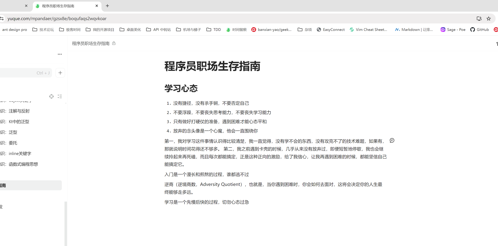
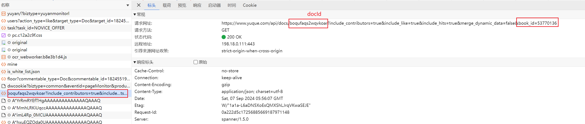
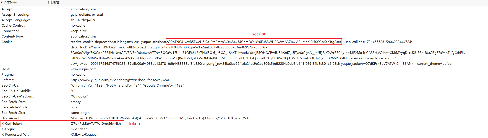

# 语雀多平台同步
做这个项目的初衷：希望利用语雀作为文档编辑器，将自己写的博客可以分享到各个平台
大致思路：将语雀的文章内容转化为Markdown,再利用Markdown提交到各个平台
1. 将语雀文章转换为MarkDown Done
2. 对接[我的博客](pandaer.space) TODO
3. 对接CSDN平台 TODO
4. 对接掘金平台 TODO

# 命令行版本 本地转换为MarkDown
必要的参数
1. bookId 知识库ID
2. dockId 文档ID
3. token  必要的权限信息
4. session 必要的权限信息

## 如何获取必要参数
随便打开一篇你自己的文章,比如下面这样


然后打开开发者工具，就会看到如下请求

到此你就获取到了bookId以及docId

接下来就会获取Token相关的信息，也在这个请求中

到此你就有了全部的必要信息了，就可以开始使用这个命令行工具了

# 如何安装
1. 克隆本项目
2. 在项目的根目录中执行 `npm install`
3. 在项目的根目录中执行 `npm link` 
4. 接下来就可以愉快的使用了


# 如何使用？
## 配置Token以及Session
```shell
yuque-sync config token your_token
yuque-sync config session your_session
```
## 转换一篇文章
```
yuque-sync sync --book your_book_id --doc your_doc_id
```


